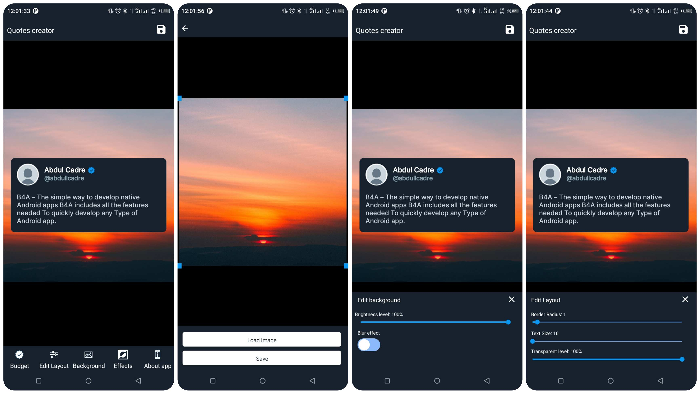

# Repositório do App Quotey

[](https://play.google.com/store/apps/details?id=com.abdullcade.Quotey)

## Introdução

Bem-vindo ao repositório do Quotey App! Quotey é uma poderosa ferramenta para criar e partilhar citações inspiradoras. Este repositório contém o código-fonte e proporciona um espaço para colaboração e contribuição da comunidade.

## Funcionalidades

- Crie citações bonitas e inspiradoras.
- Partilhe citações facilmente em várias plataformas.
- Personalize fontes, estilos e layouts.

## Como Começar

Para começar com o desenvolvimento do app Quotey, siga estes passos:

1. **Clone o Repositório:**
   ```bash
   git clone https://github.com/seu-utilizador/QuoteyApp.git
   ```

2. **Vá até a Pasta do Projeto:**
   ```bash
   cd QuoteyApp
   ```

3. **Explore o Código:**
   Navegue pelo código-fonte para entender a estrutura do app.

4. **Contribua:**
   Se deseja contribuir, consulte as [Diretrizes de Contribuição](CONTRIBUTING.md) para mais informações.

## Capturas de Ecrã

Inclua algumas capturas de ecrã ou representações visuais do seu app aqui.



## Baixe o Quotey

[](https://play.google.com/store/apps/details?id=com.abdullcade.Quotey)

## Licença

Este projeto está licenciado sob a [Licença MIT](LICENSE).

## Agradecimentos

Agradecimentos especiais a todos os contribuidores que ajudam a tornar o Quotey ainda melhor!
